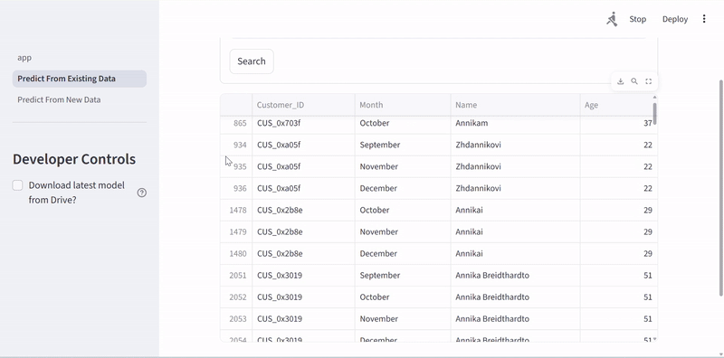

# Amex: Credit Score Classification

### 👥 **Team Members**

| Name          | GitHub Handle  | Contribution                                                             |
| ------------- | -------------- | ------------------------------------------------------------------------ |
|               | @              | Model evaluation, performance analysis, results interpretation           |
|               | @              | Model evaluation, performance analysis, results interpretation           |
|               | @              | Model evaluation, performance analysis, results interpretation           |
|               | @              | Model evaluation, performance analysis, results interpretation           |
|               | @              | Model evaluation, performance analysis, results interpretation           |
|               | @              | Model evaluation, performance analysis, results interpretation           |
| Shizuka Takao | @shizuka-takao | Data preprocessing, model training (XGBoost), implementing Streamlit App |

## 🎯 **Project Highlights**

- Developed a machine learning model using Random Forest and XGBoost to address credit score classification (Poor / Standard / Good).
- Achieved validation accuracy ≈0.83, macro F1 ≈0.83, AUC >0.89 (XGBoost) strengthening reliability of credit segment decisions.
- Generated actionable insights by analyzing ROC / PR curves, confusion matrix, and 6‑month feature trends to refine early risk thresholds.
- Implemented class imbalance mitigation (class weighting / SMOTE), handling outliers, and handling invalid data (sentinel, missing) to address industry expectations.
- Delivered a Streamlit app with two workflows (existing customer timeline exploration and new input form) to serve the trained model and return real‑time class probabilities.
- Automated quality & deployment via GitHub Actions: CI (flake8, smoke import tests), Dependabot dependency updates, and deployment readiness validation workflow.

## 🏗️ **Project Overview**

This project aims to develop a supervised machine learning model that classifies customers into credit score brackets using their historical credit and bank data. The main goal is to automate the credit score segmentation process, reducing manual work and ensuring consistent, data-driven assessments.



[Click here for full demo video](https://youtu.be/fZO_7D8GT_8)

### Disclaimer

All dataset records in this repository are synthetic and do not represent real individuals, accounts, or financial activity. Predictions are for demonstration only and should not be used for actual credit decisions.

### Project Components

- **Predict From Existing Data** : This page is for exploring credit scores of existing customers.

  Enter or pick a customer ID to:

  1. See a list of matching customers.
  2. Select one to view their monthly financial timeline.
  3. Generate a credit standing prediction (Poor / Standard / Good) for each month with probability indicators.

- **Predict From New Data** : Use this when evaluating a hypothetical or newly onboarded customer by filling out a short form (age, income, debts, counts of cards/loans, etc.).
- **ml_pipeline_notebook** : Consists of the machine learning pipeline from data preprocessing to model training & evaluation.

## 👩🏽‍💻 **Setup and Installation**

### Clone the Repository

To clone this repository and navigate into the project directory, run:

```bash
git clone https://github.com/tlee817/amex-credit-score-classification.git
cd amex-credit-score-classification
```

### Installation

- Python 3.9+
- Install dependencies after creating a virtual environment.

#### Setup (Windows PowerShell)

```powershell
python -m venv .venv
.venv\Scripts\activate
pip install -r requirements.txt
```

#### Setup (macOS / Linux Bash or zsh)

```bash
python3 -m venv .venv
source .venv/bin/activate
pip install -r requirements.txt
```

### Before Running Locally

#### 1. Download `test_clean.csv`

Download from Amex1A/Data in Google Drive:
https://drive.google.com/file/d/1sY2GjJEdTgpigA2lvhyi7ZwNUc-Jf1cA/view?usp=sharing

#### 2. Create a `data/` directory (if not present)

```bash
mkdir data
```

#### 3. Place the file in the directory

Move the downloaded file into:

```
project_root/data/test_clean.csv
```

### Run the Streamlit App

```bash
streamlit run app.py
```

## Troubleshooting: XGBoost on macOS

If you see an error like

1. Install libomp with Homebrew:

```bash
brew install libomp
```

2. Activate your project v"libxgboost.dylib could not be loaded" that references a missing `libomp.dylib`, macOS usually needs the OpenMP runtime installed. On macOS (Intel or Apple Silicon) the quickest fix is:
   irtualenv and verify XGBoost loads:

```bash
source .venv/bin/activate
python -c "import xgboost; print('xgboost', xgboost.__version__)"
```

If `brew` is not available, the alternative is to use a conda environment (conda installs OpenMP/compilers) or reinstall xgboost from a wheel that bundles runtimes. If problems persist, try:

```bash
pip uninstall -y xgboost
pip install --no-cache-dir xgboost
```

Add this section to help other developers who run into the same macOS XGBoost / libomp issue.

## 📊 **Data Exploration**

**You might consider describing the following (as applicable):**

- The dataset(s) used: origin, format, size, type of data
- Data exploration and preprocessing approaches
- Insights from your Exploratory Data Analysis (EDA)
- Challenges and assumptions when working with the dataset(s)

**Potential visualizations to include:**

- Plots, charts, heatmaps, feature visualizations, sample dataset images

## 🧠 **Model Development**

**You might consider describing the following (as applicable):**

- Model(s) used (e.g., CNN with transfer learning, regression models)
- Feature selection and Hyperparameter tuning strategies
- Training setup (e.g., % of data for training/validation, evaluation metric, baseline performance)

## 📈 **Results & Key Findings**

### Performance Summary (Validation Set)

- Overall Accuracy: ~0.83
- Macro F1: ~0.83 (balanced across classes despite class size differences)
- ROC AUC (per class): >0.89 for all (indicates strong rank ordering)
- Precision-Recall: Class 1 (Standard) shows highest Average Precision (~0.92+), Classes 0 (Poor) and 2 (Good) stable (~0.82–0.90 range)

## 🚀 **Next Steps**

### Known Limitations

- **Month Feature Leakage**: The temporal index feature Month was inadvertently included during training, introducing potential leakage (model may partially learn position in timeline rather than underlying behavior). Retraining without Month was attempted but constrained by available compute; current results are reported with this caveat.
- **At_Risk_Flag Availability**: The engineered At_Risk_Flag (derived from historical delay_from_due_date patterns) is not exposed in the “Predict From New Data” form because single‑month inputs lack the required history. It is retained only for existing customers in "Predict From Existing Data". Future revision: redesign new‑customer flow to accept a short recent history window or retrain excluding this feature for consistency.

### Planned Improvements

- **Month Feature Leakage**: Retrain the model to ensure that model performance is solely driven by customer attributes
- **At_Risk_Flag Availability**: redesign new‑customer flow to accept a short recent history window or retrain excluding this feature for consistency.

## 📝 **License**

This project is licensed under the MIT License.

## 📄 **References**

- Break Through Tech @ Cornell Tech – ML Foundations Course Materials
- Streamlit Documentation. https://docs.streamlit.io/
- Hands on Machine Learning: https://bradleyboehmke.github.io/HOML/gbm.html#xgboost

## 🙏 **Acknowledgements**

- **Jenna Hunte** – Provided structured weekly feedback, timeline guidance, and consistent mentorship supporting delivery quality and pace.
- **Saurabh Gupta** – Advised on ML pipeline design, clarified technical challenges, and set clear milestone objectives.
