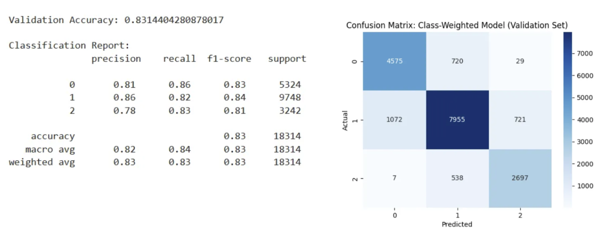
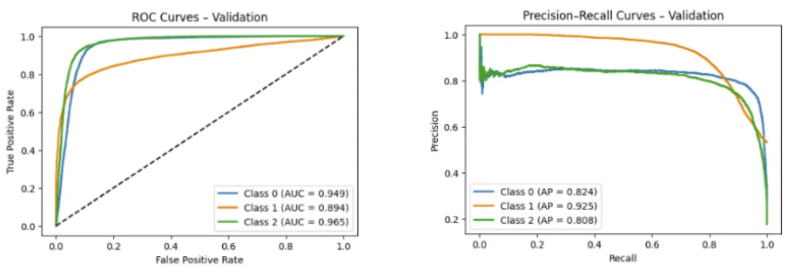

# Amex: Credit Score Classification

### 👥 **Team Members**

| Name            | GitHub Handle  | Contribution                                                             |
| --------------- | -------------- | ------------------------------------------------------------------------ |
|                 | @              | Model evaluation, performance analysis, results interpretation           |
|                 | @              | Model evaluation, performance analysis, results interpretation           |
|                 | @              | Model evaluation, performance analysis, results interpretation           |
|Janine Bokingkito| @ja9kyl3       | Data preprocessing, model evaluation (XGBoost & NeuralNetwork)           |
| Grace Yan       | @graceshawyan  | Data preprocessing, model evaluation (XGBoost), GitHub Actions CI/CD     |
| Ellen Chen      | @echen078      | Data preprocessing, model training & evaluation (Random Forest)          |
| Shizuka Takao   | @shizuka-takao | Data preprocessing, model training (XGBoost), implementing Streamlit App |

## 🎯 **Project Highlights**

- Developed a machine learning model using Random Forest and XGBoost to address credit score classification (Poor / Standard / Good)
- Achieved validation accuracy ≈0.83, macro F1 ≈0.83, AUC >0.89 (XGBoost) significying clear class separation and reliable model performance
- Evaulated each model by analyzing ROC / PR curves and confusion matrix ensuring performance across different categories
- Implemented class imbalance mitigation (class weighting / SMOTE), handling outliers, and handling invalid data to ensure data quality
- Delivered a Streamlit app to serve the trained model and return real‑time class probabilities
- Automated quality & deployment via GitHub Actions: CI (flake8, smoke import tests), Dependabot dependency updates, and deployment readiness validation workflow

## 🏗️ **Project Overview**

This project aims to develop a supervised machine learning model that classifies customers into credit score brackets using their historical data. The main goal is to automate the credit score classification process, reducing manual work and ensuring consistent, data-driven assessments.


[Click here for full demo video](https://youtu.be/R5pYUYfXd0k)

[Try out our app](https://tlee817-amex-credit-score-classification-app-deployment-xhosro.streamlit.app/)

### Disclaimer

All dataset records in this repository are synthetic and do not represent any real individuals, accounts, or financial activity. This project is intended solely for educational purposes. All model outputs and predictions are for demonstration only and must not be used for actual credit evaluation or decision-making.

### Project Components

- **Predict From Existing Data** : This page is for exploring credit scores of existing customers
- **Predict From New Data** : Use this when evaluating a hypothetical or newly onboarded customer by filling out a short form
- **ml_pipeline_notebook** : Consists of the machine learning pipeline from data preprocessing to model training & evaluation

## 👩🏽‍💻 **Setup and Installation**

### Clone the Repository

To clone this repository and navigate into the project directory, run:

```bash
git clone https://github.com/tlee817/amex-credit-score-classification.git
cd amex-credit-score-classification
```

### Installation

- Python 3.9+
- Install dependencies after creating a virtual environment.

#### Setup (Windows PowerShell)

```powershell
python -m venv .venv
.venv\Scripts\activate
pip install -r requirements.txt
```

#### Setup (macOS / Linux Bash or zsh)

```bash
python3 -m venv .venv
source .venv/bin/activate
pip install -r requirements.txt
```

### Before Running Locally

#### 1. Download `test_clean.csv`

Download from Amex1A/Data in Google Drive:
https://drive.google.com/file/d/1sY2GjJEdTgpigA2lvhyi7ZwNUc-Jf1cA/view?usp=sharing

#### 2. Create a `data/` directory (if not present)

```bash
mkdir data
```

#### 3. Place the file in the directory

Move the downloaded file into:

```
project_root/data/test_clean.csv
```

### Run the Streamlit App

```bash
streamlit run app.py
```

## Troubleshooting: XGBoost on macOS

If you see an error like

1. Install libomp with Homebrew:

```bash
brew install libomp
```

2. Activate your project v"libxgboost.dylib could not be loaded" that references a missing `libomp.dylib`, macOS usually needs the OpenMP runtime installed. On macOS (Intel or Apple Silicon) the quickest fix is:
   irtualenv and verify XGBoost loads:

```bash
source .venv/bin/activate
python -c "import xgboost; print('xgboost', xgboost.__version__)"
```

If `brew` is not available, the alternative is to use a conda environment (conda installs OpenMP/compilers) or reinstall xgboost from a wheel that bundles runtimes. If problems persist, try:

```bash
pip uninstall -y xgboost
pip install --no-cache-dir xgboost
```

Add this section to help other developers who run into the same macOS XGBoost / libomp issue.

## 📊 **Data Exploration**

### **Dataset Overview**

- **Origin:** Synthetic dataset created by American Express to resemble real-world credit and financial behavior
- **Format & Size:** CSV files with monthly records per customer; 100k entries in the training set with 28 features
- **Type of Data:** Mixed numeric and categorical fields describing income, loans, payment behavior, credit history, and monthly financial activity

### **EDA Insights**

- Target classes showed moderate imbalance (Standard ~53%, Poor ~29%, Good ~18%)
- Many numeric columns were stored as strings with underscores, hyphens, or missing tokens
- Outliers and domain-inconsistent values were present (e.g., negative delayed payments, unrealistic age)

### **Preprocessing Approach**

- Imputed missing values using customer-level medians/modes
- Cleaned invalid entries using domain-informed knowledge
- Applied outlier handling using IQR/winsorization for skewed numeric features
- Ensured alignment between training and test sets, removing fields that do not contribute to prediction (eg. ID, SSN, Month)

## 🧠 **Model Development**

### **Model**

- **Baselines:** Logistic Regression, Decision Tree
- **Ensembles:** Random Forest, XGBoost
- **Training Setup:** 80/20 split of `train.csv` for training and validation
- **Evaluation Metrics:** Confusion matrix, ROC–AUC, and Precision–Recall curves

### **Hyperparameter Tuning**

- Applied a two-stage tuning process:
  - **Broad Search:** RandomizedSearchCV over a wide parameter space (e.g., `n_estimators`, `max_depth`, `learning_rate`)
  - **Fine Search:** Narrowed ranges around Stage-1 best parameters for precise optimization
- Final hyperparameters were chosen using 5-fold cross-validation, with macro F1 as the primary scoring metric to ensure balanced performance across all credit score classes

### **Feature Selection**

- Used XGBoost feature importance rankings to identify features the model most relies on
- Evaluated multiple importance thresholds (0.005–0.01) using 5-fold CV
- Selected the threshold with the highest macro F1 and retrained the final model using only the most informative feature

### **Class Imbalance Handling**

- The target classes (Poor / Standard / Good) were moderately imbalanced
- Addressed this using class weighting during training and experimented with SMOTE on the training split to improve minority-class recall
- Macro F1 was used as the primary evaluation metric to ensure balanced performance across all classes.

## 📈 **Results & Key Findings**

### Performance Summary (Validation Set)

- **Accuracy:** ~0.83
- **Macro F1:** ~0.83 (well-balanced across all three classes)
- **ROC AUC:** >0.89 for every class
- **Precision–Recall:**

  - Class 1 (**Standard**) achieves the highest Average Precision
  - Classes 0 (**Poor**) and 2 (**Good**) also remain stable

  
  

  ### Key takeaways

  - Most misclassifications occur **between adjacent credit categories** (Standard ↔ Poor or Standard ↔ Good).
  - **Direct Poor ↔ Good confusion is rare**, indicating the model learns an ordered structure rather than random class separation

## 🚀 **Next Steps**

### Known Limitations

- **Month Feature Leakage**: The feature "Month" was accidentally included during training, introducing potential leakage where the model may be dependent on this feature instead of solely focusing on customer behavior. Retraining without Month was attempted but constrained by available computational resources. Note that current results are reported with this caveat.
- **At_Risk_Flag Availability**: The engineered At_Risk_Flag (derived from historical delay_from_due_date patterns) is not exposed in the “Predict From New Data” form in the Streamlit app because single‑month inputs lack the required history. It is retained only for existing customers in "Predict From Existing Data".

### Planned Improvements

- **Month Feature Leakage**: Retrain the model to ensure that model performance is solely driven by customer attributes
- **At_Risk_Flag Availability**: redesign new‑customer flow to accept a one month history window or retrain excluding this feature for consistency

## 📝 **License**

This project is licensed under the MIT License.

## 📄 **References**

- Break Through Tech @ Cornell Tech – ML Foundations Course Materials
- Streamlit Documentation. https://docs.streamlit.io/
- Hands on Machine Learning: https://bradleyboehmke.github.io/HOML/gbm.html#xgboost

## 🙏 **Acknowledgements**

- **Jenna Hunte** – Provided thoughtful weekly feedback, timeline guidance, and steady mentorship that helped us stay organized, focused, and confident throughout the project.
- **Saurabh Gupta** – Offered clear direction on the ML pipeline, helped us navigate technical challenges, and set meaningful milestone goals. He also worked with others at American Express to host this challenge and make available a carefully designed synthetic dataset that reflects real-world financial scenarios, allowing us to work on problems that feel meaningful and practical.

_We are truly grateful for all the support and time invested in helping us grow through this project!_ :)
